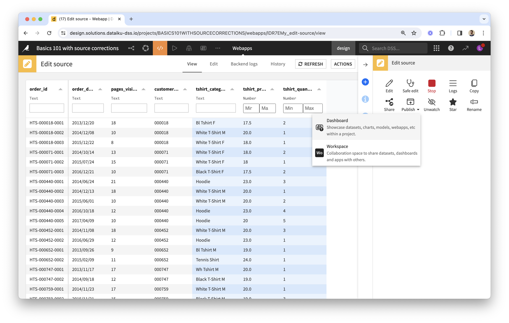

# Building a complete application to test with end-users

As a first step, make sure to read the [How to Use](https://www.dataiku.com/product/plugins/visual-edit/#how-to-use) guide on the plugin's presentation page.

## Integrating edits in automation Scenarios

Remember that edits made via the webapp are not instantly reflected in the _edits_ and _edited_ datasets (only the _editlog_ is updated in real-time).

We recommend creating the following automation Scenarios, which can be scheduled or triggered manually (by data experts from the Scenario environment, or by business users from a Dashboard if a Scenario tile was added):

* **_Commit Edits_**, to take the latest webapp edits into account in downstream pipelines and reports.
* **_Update Source_**, to take into account any changes or additional data from source systems.
  * Note that this would not take any new edits into account: it would apply edits already integrated into the pipeline, on top of any changes to the updated source data.
  * You would typically want to notify end-users via email if there is new data to review, via the use of Scenario Reporters.
* **_Reset Edits_**, for test purposes (only use this on a design node and remove when deploying).

Here is how to implement these Scenarios:

* Create a _Build edited and downstream datasets_ Scenario. It simply consists in building the _edited_ dataset in "Run recipes downstream" mode.
* _Commit Edits_:
  * Build the _edits_ dataset in "Force-build dependencies" mode (this forces execution of the Replay Edits recipe on the _editlog_).
  * Run _Build edited and downstream datasets_.
* _Update Source_:
  * Build the Original Dataset used by the webapp in "Build required dependencies" mode.
  * Run _Build edited and downstream datasets_.
* _Reset Edits_ should use the plugin's **Initialize editlog** Scenario Step (found toward the end of the list of available Steps) and run the _Commit Edits_ Scenario.

## Lifecycle: handling updates to the original dataset

It is important to note the following on the behavior of the webapp and of the Apply Edits recipe (which produces the edited dataset):

* If a cell was edited, the edited value will override any updates made on the original dataset, even if they are posterior to the edit.
* Similarly, if a row was validated, the validated values from that row will override any updates made on editable columns of the original dataset, even if they are posterior to the validation.

## Publishing the webapp to a Dashboard

The best way to make the webapp accessible to business users is by publishing it to a Dashboard. There can be 2 separate Dashboards for Editing and for Reporting purposes (if their end-users are different), or there can be a single Dashboard with 2 pages.

* Editing Dashboard:
  * From the Webapp view, click on the **ACTIONS** button of the menu in the top-right corner, to publish the webapp to a Dashboard. 
  * From the Dashboard view, you can add other "tiles" to the page, such as a Text tile with instructions on how to use the webapp, or a Scenario tile displayed as a button to run the _Commit Edits_ Scenario discussed above. You can also adjust the layout. 
* Reporting Dashboard:
  * This would consist in charts built from the _edited_ dataset or other datasets downstream.
  * It could include a Scenario tile to run the _Update Source_ Scenario.
  * It would be accessed by business users via the web, and it could also be scheduled to be converted to a PDF and sent by email via a Scenario.

Make sure to also include a Help page in each Dashboard, with instructions tailored to the end-user on how to use the webapp (see [example](data-table-features)) or how to interpret the reports.

Important remarks on deployment:

* This Dashboard and its associated link would only be for test purposes.
  * Because you're building a project with an interface where users can enter data which then gets processed, you'll need to have two instances of the project: one for development and one for production; each will have its own set of edits.
  * Once your tests are successful, the next step is to [deploy your project](deploy) on an automation node, or as a duplicate project on your design node.
* End-users must be Dataiku users on a Reader license or above.
