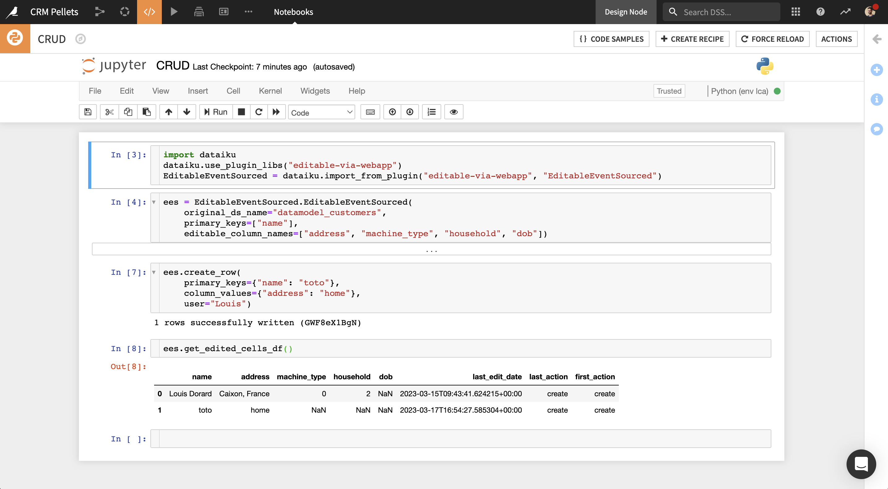

# Plugin: Data Editing for Coders | Dataiku



As an alternative to using the Data Editing Visual Webapp, you can use the following in a Python webapp.

## Instantiate the `EditableEventSourced` class

Make sure to use a code environment which has the `dash_extensions` library.

```python
import dataiku
dataiku.use_plugin_libs("editable-via-webapp")
EditableEventSourced = dataiku.import_from_plugin("editable-via-webapp", "EditableEventSourced")
ees = EditableEventSourced.EditableEventSourced(
    original_ds_name="my_dataset",
    primary_keys=["id"],
    editable_column_names=["existing_editable_col", "new_editable_col"]
)
```

`editable_column_names` can contain names of columns found in the original dataset, and names of new columns as well.

When EES is instantiated on a given dataset, it creates an "editlog" dataset and 2 recipes that create an "editlog pivoted" and an "edited" dataset, if they don't already exist.

## Use EES methods to perform CRUD operations

Available methods:

* create_row
* get_row
* get_edited_cells_df
* update_row
* delete_row
* empty_editlog: delete all rows of the editlog (use with caution)

See docstrings in the code for more information.
