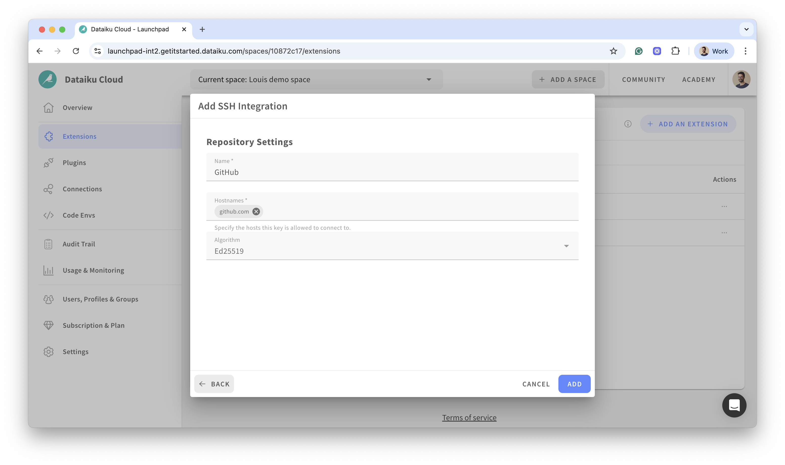
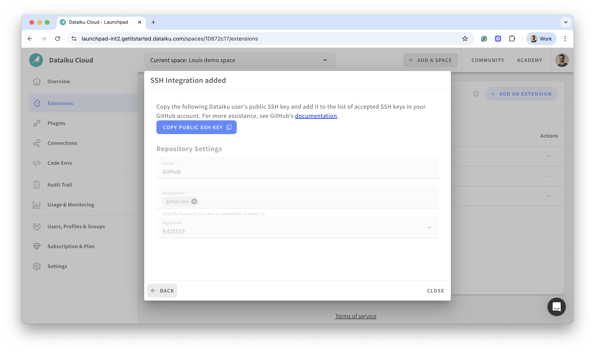
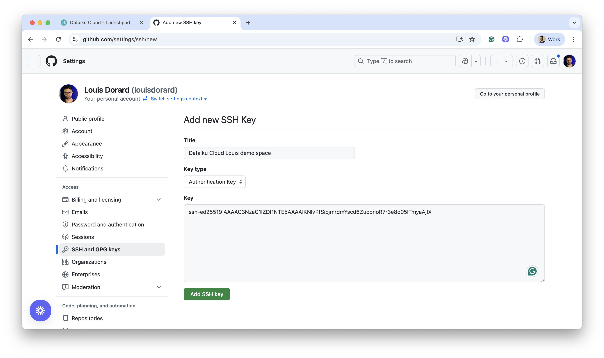
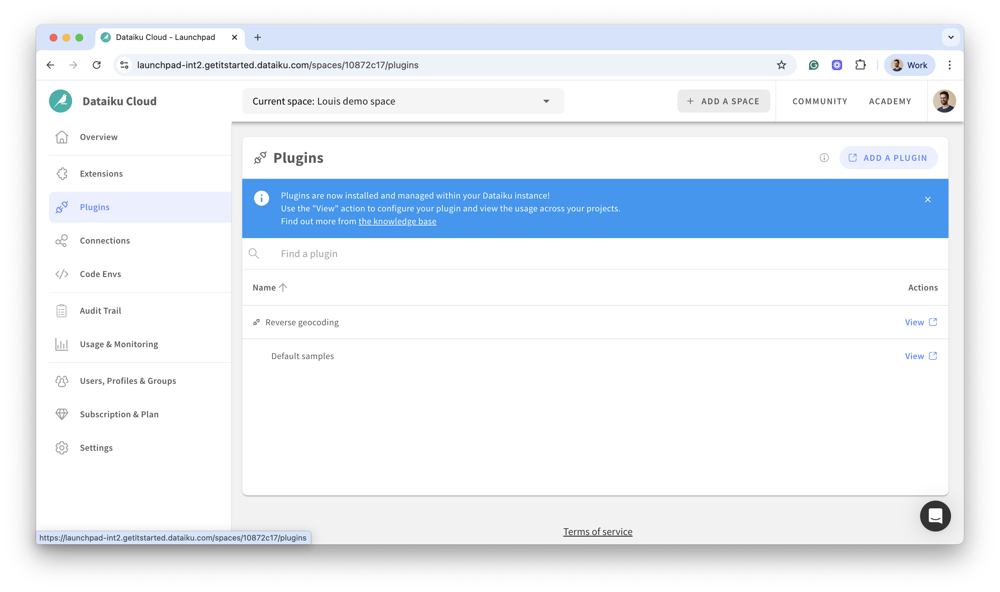

# Dataiku Cloud: GitHub remote repository setup

We demonstrate the setup process for Dataiku Cloud found in the [Dataiku Documentation: Working with Git > Working with remotes > Setup](https://doc.dataiku.com/dss/latest/collaboration/git.html#setup)

- In the Dataiku Cloud Launchpad:
  - From your Space's **Extensions** section, click **+ Add an extension** then, under **Coding**, click **SSH Integration**. 
  - Click **Copy Public SSH key**. 
- In GitHub: In the [Add SSH key](https://github.com/settings/ssh/new) page, paste the copied key into the "Key" field and give it a Title. 
- In the Dataiku Cloud Launchpad: From your Space's **Plugins** section, click **Add a plugin**. This takes you to the plugin management environment of your Space's Design node. 

You can then follow the steps in the [Installing the plugin via Git](install-plugin.md#installing-the-plugin-via-git) section of the Visual Edit documentation to complete the installation.