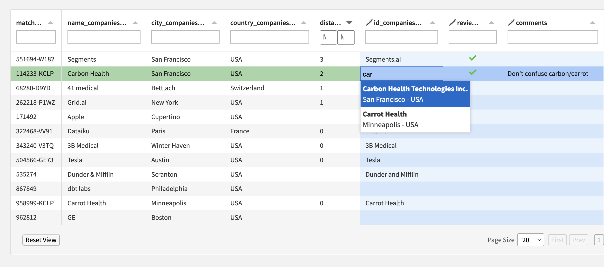

# Editschema

The editschema is a list of dictionaries in JSON format: one per column of the original dataset for which you want to provide additional settings.

## Example

```json
[
  {
    "name": "id_companies_ext",
    "editable_type": "linked_record",
    "linked_ds_name": "companies_ext",
    "linked_ds_key": "id",
    "linked_ds_label": "name",
    "linked_ds_lookup_columns": ["city", "country"]
  },
  {
    "name": "reviewed",
    "type": "boolean_tick"
  }
]
```

The first part (`id_companies_ext`) results in this behavior:



The second part (`reviewed`) results in this behavior:


## Fields

List of available fields to describe each item of the editschema:

* `name`: name of a column of the original dataset.
* `editable_type` allows to define "linked records"; the editor will be a text input with a dropdown menu showing results that match the input. Results will be coming from a given dataset, or from an API endpoint. These additional fields must be defined:
  * `linked_ds_name`: name of the dataset that is linked to the field
  * `linked_ds_key`: primary key for this dataset (there must be one and only one)
* `linked_ds_label` (optional): name of a column of the linked dataset to use for display purposes in the webapp, instead of the key
* `linked_ds_lookup_columns` (optional): list of columns from which to pull additional information to show in the dropdown menu
* `type` allows to override the column's type inferred from the original dataset's schema, or to refine it:
  * You can specify a "boolean_tick" type if you want the formatting and editing of boolean values to use only 2 states: `true` represented by a green tick icon, and no icon at all otherwise.
  * Note: the default behavior of the "boolean" type uses 3 states: `true` represented by a green tick icon, `false` represented by a red cross, and empty.
