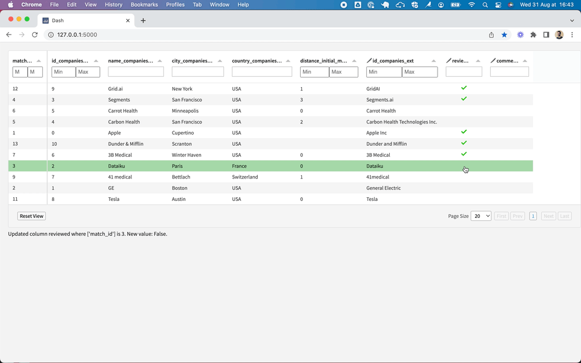

# Editschema

The editschema can be used to add specific UI behavior to editable columns. It is a JSON array of objects, each object representing a column of the original dataset.

## Fields

For each column of the original dataset you can set the following fields:

- `name`: name of a column of the original dataset.
- `type`: allows to override the column's type inferred from the original dataset's schema, or to refine it:
  - `boolean_tick` for Boolean columns: formatting and editing of boolean values behaves like a toggle with only 2 states: `true` represented by a green tick icon, and no icon at all otherwise. 
    - Note: the default behavior of the "boolean" type uses 3 states: `true` represented by a green tick icon, `false` represented by a red cross, and empty.
  - `textarea` for Text columns: this is ideal when values are longer bits of text and provides the following benefits:
    - Shows text with carriage returns intact (great for multiline text).
    - Adjusts the height of rows to fit cell contents when columns are resized.
    - Allows entering of multiple lines of plain text (when the column is editable).

## Example

```json
[
  {
    "name": "Tick column",
    "type": "boolean_tick"
  },
  {
    "name": "Long text column",
    "type": "textarea"
  }
]
```
