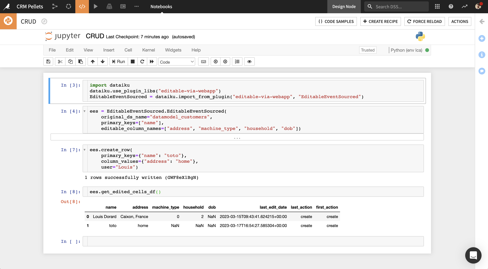

# Getting started: CRUD Python API | Plugin: Data Editing | Dataiku

TODO: show example where starting from scratch, or just getting and updating a row



As an alternative to using the Data Editing Visual Webapp, you can use CRUD (Create, Read, Update, Delete) methods provided by the `EditableEventSourced` Python class.

The implementation of these methods is based on the [Event Sourcing pattern](https://learn.microsoft.com/en-us/azure/architecture/patterns/event-sourcing): instead of storing the current (edited) state of the data, we use an append-only store to record the full series of actions taken on that data. This store is a dataset that we call the "editlog", which we create on the same connection as the original dataset, with the same name suffixed by "_editlog".

Let's take a quick tour of how to use the CRUD Python API. If you haven't, [install the plugin](install-plugin) first.

## Instantiate the `EditableEventSourced` class

```python
import dataiku
dataiku.use_plugin_libs("editable-via-webapp")
EditableEventSourced = dataiku.import_from_plugin("editable-via-webapp", "EditableEventSourced")

ees = EditableEventSourced.EditableEventSourced(
    original_ds_name="my_dataset",
    primary_keys=["id"],
    editable_column_names=["existing_editable_col", "new_editable_col"]
)
```

`editable_column_names` can contain names of columns found in the original dataset, and names of new columns as well.

When EES is instantiated on a given dataset, it creates the "editlog" dataset and 2 recipes that create an "edits" and an "edited" dataset, if they don't already exist. Read more in [Using edits in the Flow](using-edits).

Edits made via CRUD methods instantly add rows to the _editlog_.

## Use EES methods to perform CRUD operations

Here we provide an overview of available methods — more information can be found in the docstrings in the code.

### Read data

At the row level:

* get_row — read a row that was created, updated or deleted

At the dataset level (returning Pandas DataFrames):

* get_original_df — original data without edits
* get_edited_df — original data with edited values
* get_edited_cells_df — only rows and columns that were edited
* get_editlog_df

### Write data

At the row level:

* create_row - create a new row
* update_row - update any row
* delete_row - deleted any row

These methods have an optional `user` parameter (default value is "unknown"). When working in the context of an active HTTP request (e.g. in a Flask or Dash app), the following can be used to extract the identifier of the user logged into Dataiku (e.g. their email address). This identifier would be included in the request headers sent by the user's web browser.

```python
from commons import get_user_identifier
commons = dataiku.import_from_plugin("editable-via-webapp", "commons")
user = commons.get_user_identifier()
```

At the dataset level:

* empty_editlog: delete all rows of the editlog (use with caution)

TODO: Video with all methods, for CRM and Join Companies examples

## Next

* [Using edits in the Flow](using-edits): Where to find edits and how to leverage them for analytics
