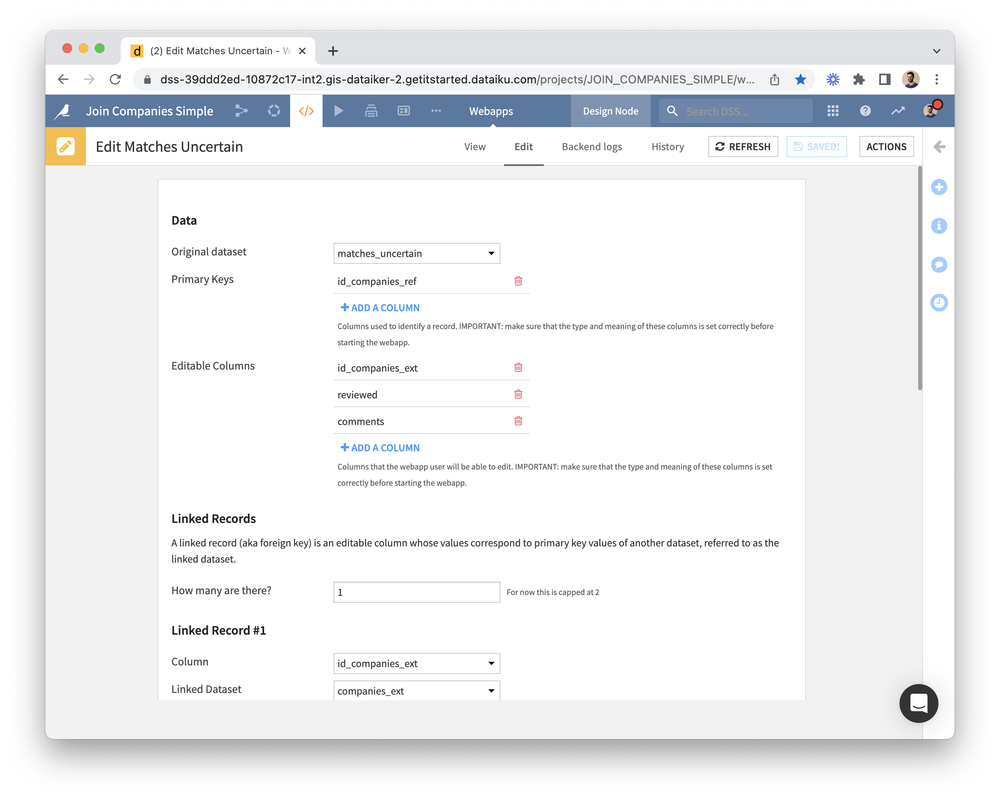
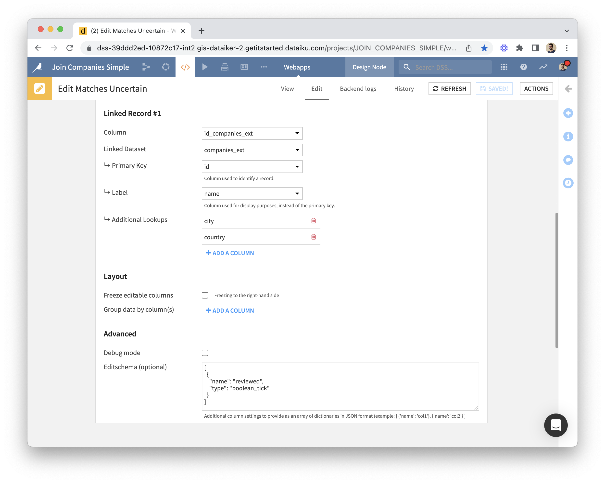

# Getting started: Visual Webapp | Plugin: Data Editing | Dataiku

If you haven't, [install the plugin](install-plugin) first.

## Creating a Data Editing webapp

* Once you've identified the dataset to edit via a webapp, please review its schema as a first step.
  * The webapp uses column meanings to show data (or let you edit it) in the best way. If the meaning wasn't defined explicitly, the webapp uses the storage type instead.
  * If a column has missing values (which is typically the case for an editable column), make sure to use an appropriate storage type (e.g. not "integer"). When in doubt, use "string".
* Go to Webapps, create New Visual Webapp, pick Data Editing (this component is provided by the plugin).
  * 
  * 
* The webapp settings interface has several sections...
  * Under "Data" you can choose a dataset, list primary keys and editable columns (note that a column can't be both).  
  * The "Linked Records" section allows to specify editable columns whose values correspond to primary key values of another dataset. This requires the other dataset to be on a SQL connection or to have less than 1,000 records.
  * In the "Layout" section you can choose to freeze editable columns to the right-hand side (which is useful when there are many columns), and to group rows by one or more columns.
  * Additional settings can be provided via the ["editschema" in JSON](editschema).
* You can now start the webapp backend. Behind the scenes, webapp settings such as primary keys and editable columns will be copied into the corresponding _Data Editing_ fields of the chosen dataset (custom fields provided by the plugin).
* Here is an example of what a data editing webapp would look like:

## Using the webapp

Edits made via the webapp instantly add rows to the _editlog_.

What you see in the webapp is the **original dataset with overrides** coming from the editlog.

Data table features:

* Each column can be resized, filtered, and used to sort data.
* Right-clicking on the column name will show a menu with an option to hide the column, and an option to group rows according to the column's values.
* Filtering:
  * The default filter is a textual one.
  * In the case of a display-only boolean column, the filter is a tristate checkbox (or a simple checkbox if you specified the column type to be "boolean_tick" via the advanced settings' [editschema](editschema)).
  * Editable boolean columns have a textual filter that you can use by typing "true" or "false".
* All of this can be reset by clicking on the "Reset View" button in the bottom-left corner.
* Linked records are edited via dropdowns which include the ability to search through all options: when there are many of them, only options that start with the search term are presented.
* Changes in the source dataset are automatically detected and signaled. The user needs to refresh the webpage in order to see them.

## Next

* [Using edits in the Flow](using-edits): Where to find edits, Leveraging edits for analytics
