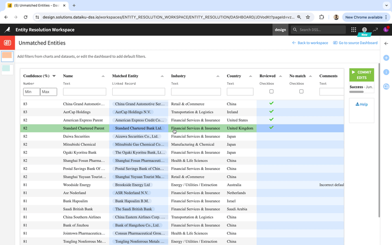
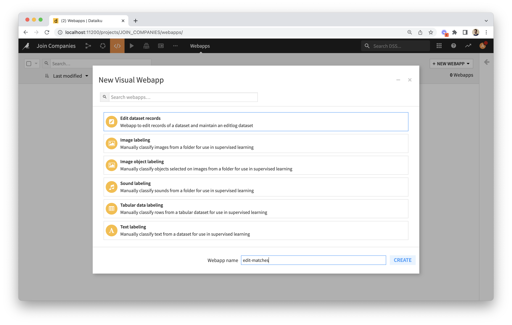
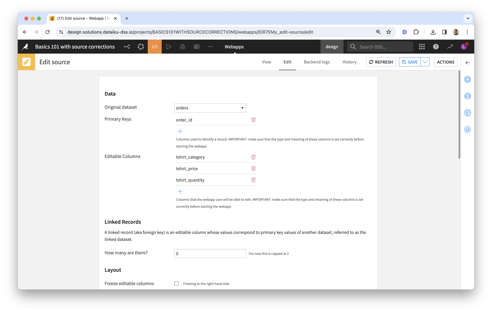
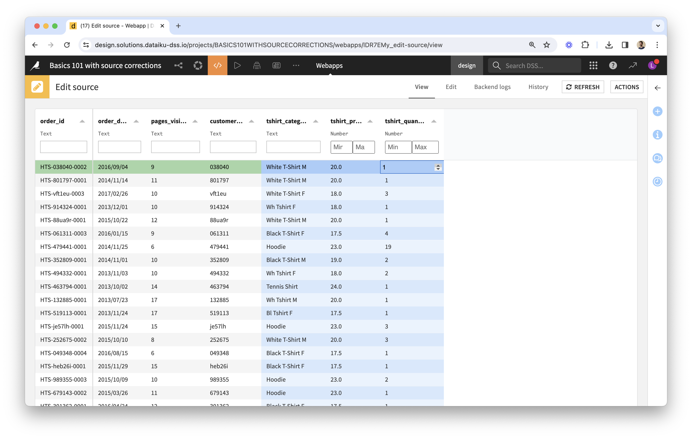
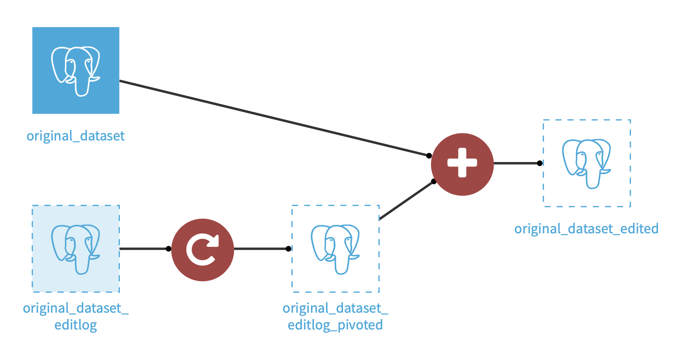

# Dataiku Plugin: Visual Edit

Spin up a visual app to validate and edit data

[Source code](https://github.com/dataiku/dss-visual-edit/)

## Use cases

Enable domain experts to…

- Validate the output of rules or AI. Examples:
  - Mass corrections/enrichment of source data: entity resolution, deduplication, categorization, dataset reconciliation, etc.
  - Operational processes: log decisions on alerts, validate suggestions of amounts to pay or orders to place, etc.
- Make tactical corrections on source data to ensure the correctness of an analytics project.

## Features

- Powerful data table with rich editing experience and a special validation column.
- No-code webapp setup and integration of edits in your pipeline, as well as low-code customizations.
- Edits dataset allowing the leverage of human feedback for continuous AI improvement.
- Audit trail of all edits.

## How to use

### Use case description

There are two main types of use cases for the plugin’s Visual Webapp:

1. Correcting source data
1. Validating machine-generated data

Let’s focus on the 1st type. We want business users (aka end-users) to edit data based on their domain expertise, and we want to use the edited data for better downstream analytics and reporting. Instead of doing this in Excel, we want end-users to access a web interface. Therefore, we need a front-end for them to see and enter data, and we need to “connect” the data entered via the web front-end to the analytics pipeline.

### Create a Visual Edit webapp

Let’s assume that you have a Dataiku DSS project with a dataset whose data you would like end-users to review and edit if corrections are needed. For illustration purposes, we use a blank project to which we upload the [t-shirt orders CSV file](https://downloads.dataiku.com/public/website-additional-assets/data/orders.csv) found in the [Basics 101 course](https://academy.dataiku.com/path/core-designer/basics-101) of the Dataiku Academy.

Navigate to the Webapps section of your project, which you can find by hovering over the 3rd icon from the project name at the top of the interface. Click the + NEW WEBAPP button, choose VISUAL WEBAPP, then VISUAL EDIT. Give a name to your webapp and click CREATE.

You are then taken to the webapp’s Edit tab:

- Data:
  - Select your Original Dataset, list Primary Keys and Editable Columns (note that a column can’t be both).
  - Double-check the selection of Primary Keys and Editable Columns. The ground-truth values of editable columns should be fixed for a given primary key value (or set of values, if using several columns as primary keys).
- Linked Records: for columns where the editor should be a dropdown widget (not used here; [find out more](linked-records)).
- Layout: here you can choose to freeze editable columns to the right-hand side (which is useful when there are many columns) and to group rows by one or more columns.
- Advanced: advanced settings can be provided via the “editschema” in JSON (not used here; [find out more](editschema)).

You can find a description of all end-user features of the data table [here](data-table-features). The webapp can be shared with Dataiku users on a Reader license or above.

### Use edits in the Flow

3 datasets are created upon starting the webapp (if they don’t already exist), using the same Connection as the original dataset’s. Their names start with the original dataset’s name. Let’s review them by their suffix:

- editlog is the raw record of all edit events captured by the webapp. It also serves as an audit trail of who edited what and when.
- edits is the output of the plugin’s Replay Edits recipe and the user-friendly view of edits:
  - It shows the cells that were edited via the webapp (edited rows and editable columns).
  - It is not “in sync” with the webapp: it’s up to you to decide when to build it in the Flow.
  - You can leverage this dataset to write corrections back to the IT system that holds the source data.
- edited is the output of the plugin’s Apply Edits recipe.
  - It corresponds to the edited data that you see via the webapp.
  - It is not “in sync” with the webapp: it’s up to you to decide when to build it in the Flow.
  - You can use this dataset instead of the original dataset as input to downstream recipes for more accurate analytics and reporting.

