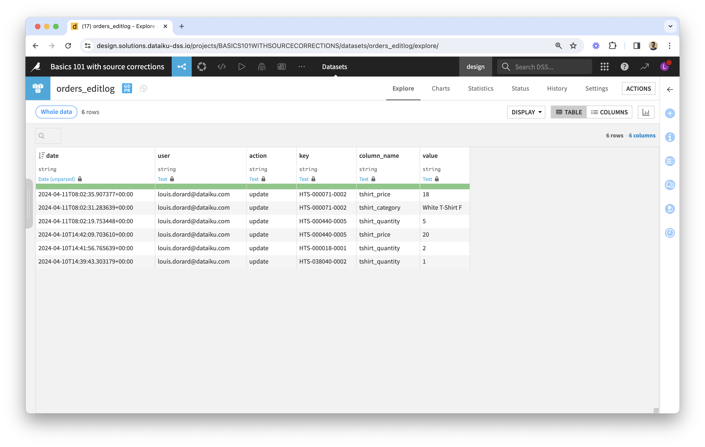
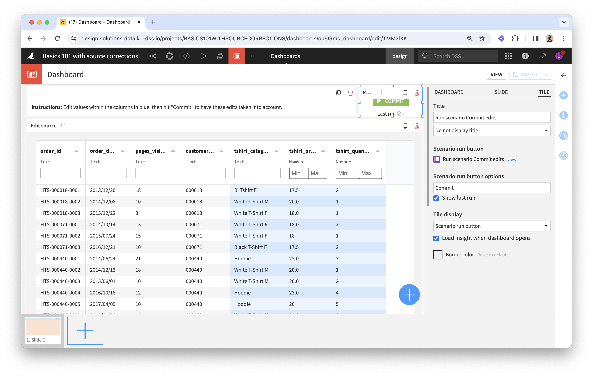

# Correcting Source Data | Plugin: Visual Edit | Dataiku

This guide is structured as follows:

* Use case description
* Preliminary steps
* Create a Visual Edit webapp
* Use edits in the Flow

## Use case description

There are two main types of use cases for the plugin's Visual Webapp:

* Correcting source data
* Reviewing machine-generated data

In this guide, we focus on the former. The latter is slightly more complex and will be covered in a [separate guide](reviewing).

Here, we want business users (aka end-users) to edit data based on their domain expertise, and we want to use the edited data for better downstream analytics and reporting. Instead of doing this in Excel, we want end-users to access a web interface. Therefore we need a front-end for them to see and enter data, and we need to "connect" the data entered via the web front-end to the analytics pipeline.

## Preliminary steps

* [ ] Confirm Visual Edit is available as a plugin on your Dataiku instance, or [Request Installation](https://calendar.google.com/calendar/u/0/appointments/schedules/AcZssZ1cgQ-IQ2k2eJMm6mUrZxabQgtPSSwaZ9TgNcHcnaUDvrqfweAkf-B7xzZbTSNyYeSRc2smgLbp).
* [ ] Create a new project and add a dataset (via an existing Connection, or file upload). The screen captures shown in this guide were taken on a new project where we uploaded the [orders CSV file](https://downloads.dataiku.com/public/website-additional-assets/data/orders.csv) found in the [Basics 101 course](https://academy.dataiku.com/path/core-designer/basics-101) of the Dataiku Academy. You could also apply the following to an existing project and dataset, which could be an "input" dataset (nothing upstream), or the output of a recipe. 
* [ ] Review the dataset's schema. The plugin's Visual Webapp uses it to display, sort, filter data and enable editing in the most appropriate way. When a column meaning was defined explicitly, the webapp will use it; otherwise it will consider the storage type instead.
  * Use a “Boolean” meaning to show boolean values as ticks and crosses and to enable editing with checkboxes; filtering will be text-based;
  * Use a numerical meaning to restrict editing to numbers only, to enable sorting by numerical order, and filtering with min-max values;
  * Use a “Date” meaning to enable sorting by chronological order, editing and filtering with date pickers;
  * Use a “Text” meaning for both free-text input and for dropdowns (this will be specified in the Visual Webapp's settings), text-based filtering, and sorting by alphabetical order.

## Create a Visual Edit webapp

* [ ] Go to Webapps, create a New Visual Webapp, pick Visual Edit (this component is provided by the plugin).  
* [ ] Settings:
  * _Data_:
    * Select a dataset, list primary keys and editable columns (note that a column can't be both). 
    * Double check the selection of primary keys and editable columns: ground-truth values of editable columns should be fixed for a given (set of) primary key value(s).
  * _Linked Records_: for columns where the editor should be a dropdown widget (not used here; [find out more](linked-records)).
  * _Layout_: here you can choose to freeze editable columns to the right-hand side (which is useful when there are many columns), and to group rows by one or more columns.
  * Advanced settings can be provided via the "editschema" in JSON (not used here; [find out more](editschema)).

The webapp should look like this:

Note that tshirt price and quantities are not seen as numerical columns: column types are shown as "Text" in the webapp (below column names) and as a result we can input any type of data in them. This is expected, because all storage types were "string" in the uploaded dataset, and no column meanings were set explicitly.

### Fix column types

* [ ] Let's set the column meanings for tshirt price and quantities as Decimal and Integer (see lock icon next to the meaning). 
* [ ] Restart the webapp. It will now consider these columns as numerical. The webapp should look like this:

### Test the webapp

* [ ] Test the webapp with a few edits. Here, you should only be able to input numerical values when editing tshirt price and quantities. See all end-user features of the webapp's data table [here](data-table-features).

### Locate edits in the Flow

3 datasets are created upon starting the webapp (if they don't already exist): 
Their names start with the original dataset's name. Let's review them by their suffix:

* **_editlog_** is the raw record of all edit events captured by the webapp. It also serves as an audit trail, for governance purposes. The schema of this dataset is fixed, whatever the original dataset. Here is an example: 
* **_edits_** is the output of the _replay-edits_ recipe (provided by the plugin) and the user-friendly view of edits. In the previous example: 
  * Its schema is a subset of the original dataset's: it doesn't have columns that are display-only, but it has the same key columns and the same editable columns, plus a _last\_edit\_date_ column.
  * Its rows are a subset of the original dataset's: it doesn't contain rows where no edits were made.
  * You can think of it as...
    * A "diff" between edited and original data.
    * A dataset of overrides to apply to the original dataset.
    * The result of "replaying" edit events stored in the log: we only see the last edited values.
* **_edited_** is the output of the _apply-edits_ recipe (provided by the plugin) that feeds from the original dataset and the _edits_.
  * It corresponds to the edited data that you are seeing via the webapp. However, it is not "in sync" with the webapp: it's up to you to decide when to build it in the Flow.
  * It contains the same number of rows as in the original dataset. For any given cell identified by its column and primary key values, if a non-empty value is found in _edits_, this value is used instead of the original one.
  * Note that, as a result of the above, it is impossible to empty a non-empty cell with the plugin’s Visual Webapp and recipes. This is because empty values in _edits_ are ignored.

#### Datasets' Connection

The datasets are created on the same Connection as the original dataset. If not already the case, **we recommend using a SQL Connection** for fast and reliable edits. For edits to be recorded by the webapp, this has to be a write Connection. If that's not the case, you can change the Connection of these datasets as soon as they've been added to the Flow.

#### Relationship between what you see in the webapp and in the Flow

* Edits made via the webapp instantly add rows to the _editlog_. The _edits_ and _edited_ datasets are updated only when you run the corresponding recipes.
* When opening the webapp in your browser, the same code as the recipes' is executed, from the original dataset and the editlog, in order to present an edited view of the data.
* When starting the webapp backend, settings such as primary keys and editable columns are copied into the _Visual Edit_ fields of the original and _editlog_ datasets ([custom fields provided by the plugin](https://doc.dataiku.com/dss/latest/plugins/reference/custom-fields.html) — see the bottom right corner of the screenshot above). This is how the recipes have access to settings defined in the webapp.

### How to reset edits

Only use this on a design node, if needed for your tests.

Create and run a _reset edits_ scenario with an "Initialize editlog" Step. This type of scenario step is provided by the plugin and can be found toward the end of the list of available steps.

## Use edits in the Flow

You may want to leverage the _edits_ dataset to write corrections back to the IT system that holds source data.

In most use cases, however, you would first use the _edited_ dataset as input to recipes, for analytics and reporting purposes. Here are a few tips when doing that:

* Edits would not be instantly reflected in your reporting, as the _edited_ dataset is not updated in real-time. You decide when you want this to happen.
* We recommend creating a **_commit edits_** scenario that builds all that is downstream of the _editlog_ and updates the reporting based on edited data. Its execution can be scheduled, or it can be triggered manually. If you have a _reset edits_ scenario, add a step at the end to also run the _commit edits_ scenario.
* If you want to allow end-users to trigger this scenario on their own, you can embed the Visual Edit webapp in a Dashboard to which you will add a Scenario tile (more on this in the next section).
* Reporting is materialized by a dashboard built from the edited dataset or other datasets downstream. This dashboard would be accessed by business users via the web, or it would be scheduled to be converted to a pdf and sent by email via a dedicated scenario. We recommend creating an **_update source_** scenario to take into account any changes or additional data from source systems, re-build the dataset used by the webapp, and re-run the _commit edits_ scenario.

## Test the webapp with a business user

Prerequisite: End-users of the webapp must be Dataiku users on a Reader license or above.

The best way to make the webapp accessible to business users is by publishing it to a Dashboard. For this, from the webapp view, click on the Actions button of the menu in the top-right corner).

You may have already created a Dashboard in your project for reporting purposes; in this case, add the webapp to a new Slide of the dashboard.

You can then add other "tiles" to your Dashboard, such as a Text tile with instructions on how to use the webapp, or a Scenario tile, and adjust the layout.

The Scenario tile is displayed as a button to run a chosen scenario (typically the _commit edits_ scenario discussed above).

## Next

* If you need to customize the way the webapp displays data and create your own Visual Edit front-end, check out the [introduction to Visual Edit's CRUD Python API](https://github.com/dataiku/dss-visual-edit/blob/master/docs/CRUD_example_usage.ipynb) and examples of [low-code webapp customizations with Dash](dash-examples) to learn how to use the plugin's data persistence layer for your webapp's backend.
* Because we're building a project with an interface where users can enter data which then gets processed, we'll need to have two instances of the project leveraging the plugin: one for development, one for production; each will have its own set of edits. Once all your tests are successful, the next step is to [deploy your project](deploy) on an automation node, or as a duplicate project on your design node.
* If you're interested in the use case of [reviewing machine-generated data](reviewing), check out the dedicated guide.
* You can also check out the [FAQ](faq) to learn more about the plugin.