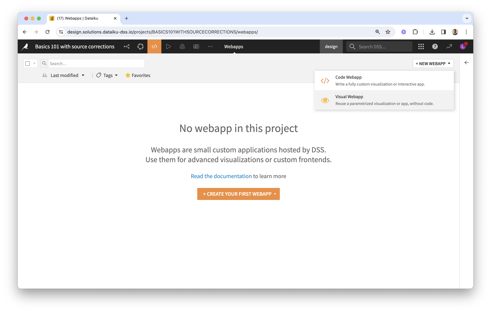
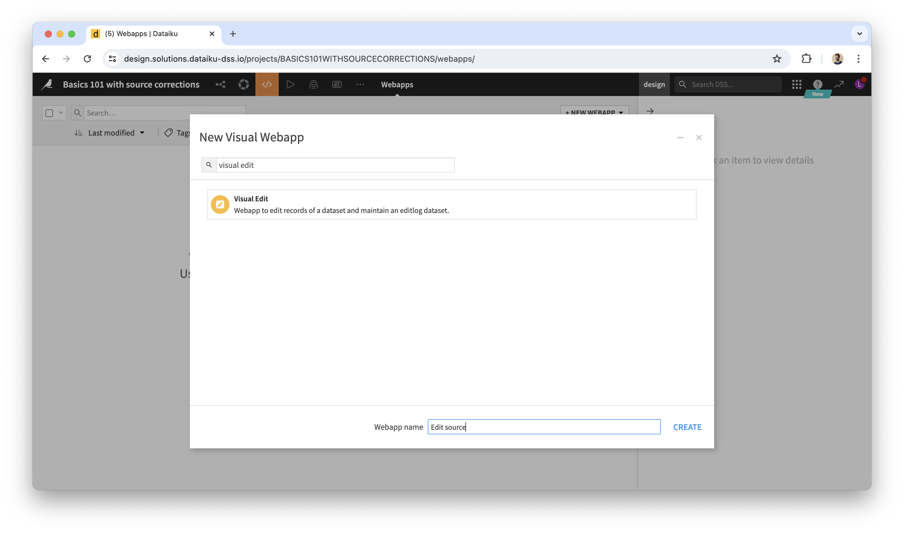
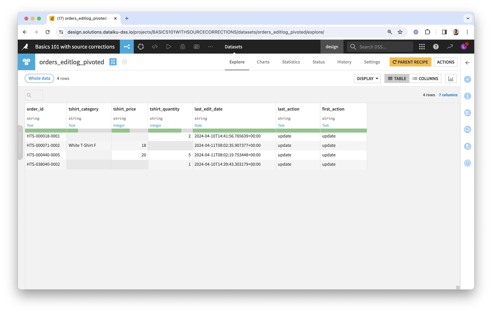

# Getting started | Plugin: Data Editing | Dataiku

If you haven't, [install the plugin](install-plugin) first.

## Creating a Data Editing webapp

* Once you've identified the dataset to edit via a webapp, please review its schema as a first step.
  * The webapp uses column meanings to show data (or let you edit it) in the best way. If the meaning wasn't defined explicitly, the webapp uses the storage type instead.
  * If a column has missing values (which is typically the case for an editable column), make sure to use an appropriate storage type (e.g. not "integer"). When in doubt, use "string".
* Go to Webapps, create New Visual Webapp, pick Data Editing (this component is provided by the plugin).
  * 
  * 
* The webapp settings interface has several sections...
  * Under "Data" you can choose a dataset, list primary keys and editable columns (note that a column can't be both).  
  * The "Linked Records" section allows to specify editable columns whose values correspond to primary key values of another dataset.
  * In the "Layout" section you can choose to freeze editable columns to the right-hand side (which is useful when there are many columns), and to group rows by one or more columns.
  * Additional settings can be provided via the ["editschema" in JSON](editschema).
* You can now start the webapp backend. Behind the scenes, webapp settings such as primary keys and editable columns will be copied into the corresponding _Data Editing_ fields of the chosen dataset (custom fields provided by the plugin).
* Here is an example of what a data editing webapp would look like:

## Making edits

Data table features:

* Each column can be resized and filtered.
* Filtering:
  * The default filter is a textual one.
  * In the case of a display-only boolean column, the filter is a tristate checkbox (or a simple checkbox if you specified the column type to be "boolean_tick" via the advanced settings' [editschema](editschema)).
  * Editable boolean columns will have a textual filter that you can use by typing "true" or "false".
* Right-clicking on the column name will show a menu with an option to hide the column, and an option to group rows according to the column's values.
* All of this can be reset by clicking on the "Reset View" button in the bottom-left corner.

## Using edits in the Flow

### Where to find edits

The webapp backend automatically creates 3 datasets upon starting up (if they don't already exist):

Their names start with the original dataset's name. Let's review them by their suffix:

 1. **_editlog_** is the raw record of all edit events captured by the webapp. The schema of this dataset is fixed, whatever the original dataset. Here is an example: 
 2. **_editlog\_pivoted_** is the output of the _pivot-editlog_ recipe (provided by the plugin) and the user-friendly view of edits. In the previous example: 
    * Its schema is a subset of the original dataset's: it doesn't have columns that are display-only, but it has the same key columns and the same editable columns, plus a _last\_edit\_date_ column.
    * Its rows are a subset of the original dataset's: it doesn't contain rows where no edits were made.
    * You can think of it as...
      * A "diff" between edited and original data.
      * A dataset of overrides to apply to the original dataset.
      * The result of "replaying" edit events stored in the log: we only see the last edited values.
 3. **_edited_** is the output of the _merge-edits_ recipe (provided by the plugin) that feeds from the original dataset and the _editlog\_pivoted_.
    * It corresponds to the edited data that you are seeing via the webapp.
    * However, it is not in sync with the webapp: it's up to you to decide when to build it in the Flow.
    * It contains the same number of rows as in the original dataset. For any given cell identified by its column and primary key values, if a non-empty value is found in _editlog\_pivoted_, this value is used instead of the original one.
    * Note that, as a result of the above, it is impossible to empty a non-empty cell with the plugin’s visual webapp and recipes. This is because empty values in _editlog\_pivoted_ are ignored.

These datasets are created on the same connection as the original dataset. For edits to be recorded by the webapp, this has to be a write connection. If that's not the case, you can change the connection of these datasets as soon as they've been added to the Flow.

### Interactions between the webapp and the Flow

Edits made via the webapp instantly add rows to the _editlog_.

What you see in the webapp is the **original dataset with overrides** coming from the editlog. The webapp is based on the same code as the _pivot-editlog_ and _merge-edits_ recipes.

### Leveraging edits for analytics

Depending on your use case, you would add recipes downstream of _editlog\_pivoted_ or of _edited_. For instance, you may only need access to edited rows, found in _editlog\_pivoted_, instead of _edited_ which also contains rows that weren't edited. This is the case in our [sample project](sample-project-join-companies).

You decide when to build the datasets downstream of the _editlog_ (including _editlog\_pivoted_ and _edited_).

## Next

* [Going further](going-further): Resetting edits on a design node, Deploying to production (automation node), Feedback loops, FAQ.
* [Sample project: Join Companies](sample-project-join-companies)
