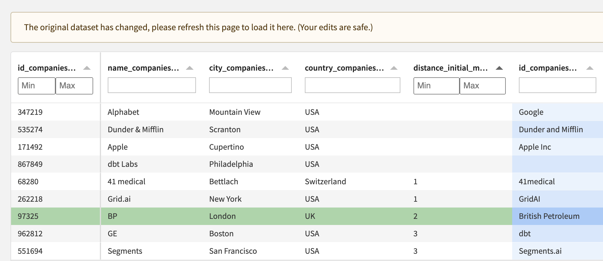

# Getting started

If you haven't, [install the _Editable via Webapp_ plugin](install-plugin) first.

## Create the webapp

* As a preliminary step, have a look at the schema of the dataset to edit and make sure that the type or the meaning of each column is set correctly: they will be used by the webapp to show data (or let you edit it) in the best way.
* Go to Webapps, create New Visual Webapp, pick Edit dataset records
  * 
  * 
* The webapp settings interface allows to choose a dataset, list key columns (used to identify rows) and editable columns, within the "Data" section. 
  * In the "Layout" section you can choose to freeze editable columns to the right-hand side (which is useful when there are many columns), and to group rows by one or more columns.
  * Additional settings can be provided via the ["editschema" in JSON](editschema).

## Start the webapp

The webapp should look like this:

Here are the datasets that the webapp backend creates automatically upon starting up (if they don't already exist):

 1. **_editlog_**, which is the raw record of all edits made via the webapp.
 2. **_editlog\_pivoted_**, which is the output of a _pivot-editlog_ recipe and the user-friendly view of edits. Its schema is a subset of that of the original dataset (it just doesn't have columns that are display-only, but it has the same key columns and the same editable columns).
 3. **_edited_**, which is the output of a _merge-edits_ recipe that feeds from the original dataset and the _editlog\_pivoted_.

## Use the webapp to make some edits

Only one user at a time.

Edits made via the webapp will instantly add rows to the _editlog_.

Data table features:

* Each column can be resized and filtered.
* Filtering:
  * The default filter is a textual one.
  * In the case of a display-only boolean column, the filter is a tristate checkbox (or a simple checkbox if you specified the column type to be "boolean_tick" via the advanced settings' [editschema](editschema)).
  * Editable boolean columns will have a textual filter that you can use by typing "true" or "false".
* Right-clicking on the column name will show a menu with an option to hide the column, and an option to group rows according to the column's values.
* All of this can be reset by clicking on the "Reset View" button in the bottom-left corner.

## Use the new datasets in the Flow

Depending on your use case, you would add recipes downstream of _editlog\_pivoted_ or of _edited_. For instance, you may only need access to edited rows, so to _editlog\_pivoted_, instead of _edited_ which also contains rows that weren't edited.

You decide when to build the datasets downstream of the _editlog_ (including _editlog\_pivoted_ and _edited_).

## FAQ

### What happens if my source dataset changes?

The webapp automatically detects changes in the original dataset, in which case it shows a button to refresh the data. This detection is carried out by periodically checking the last build date of the dataset.

As a consequence, it only works if this isn't a "source" dataset, i.e. there are recipes/datasets upstream. If you want to refresh the webapp upon changes of a source dataset, please create a Scenario with a "Restart webapp" step and a "Trigger on dataset change" or a "Trigger on sql query change".

### What happens if I change primary keys or editable columns in the webapp settings?

* Primary key:
  * Add:
    * If this primary key had already been in use in the past (and you're adding it back), there may be rows in the editlog that contain a value for this key, and these rows will be taken into account.
    * Otherwise, previous edits won't be taken into account by the webapp / the recipes.
  * Remove:
    * If the remaining keys allow to uniquely identify a row in the dataset, then there is no impact.
    * Otherwise, many rows could be impacted by a single row of the editlog (instead of a single row).
* Editable column:
  * Add: no impact.
  * Remove: previous edits on this column won't be taken into account by the webapp / the recipes, and they won't appear in _editlog\_pivoted_ (but they will still be in the editlog).

## Toy projects to use the plugin

Currently these are private to my Github account (louisdorard) — reach out for an invite to get access.

* [Categorize transactions](https://github.com/louisdorard/dataiku-categorize-transactions)
* [Join companies](https://github.com/louisdorard/dataiku-join-companies)

## Next: [Going further](going-further)
