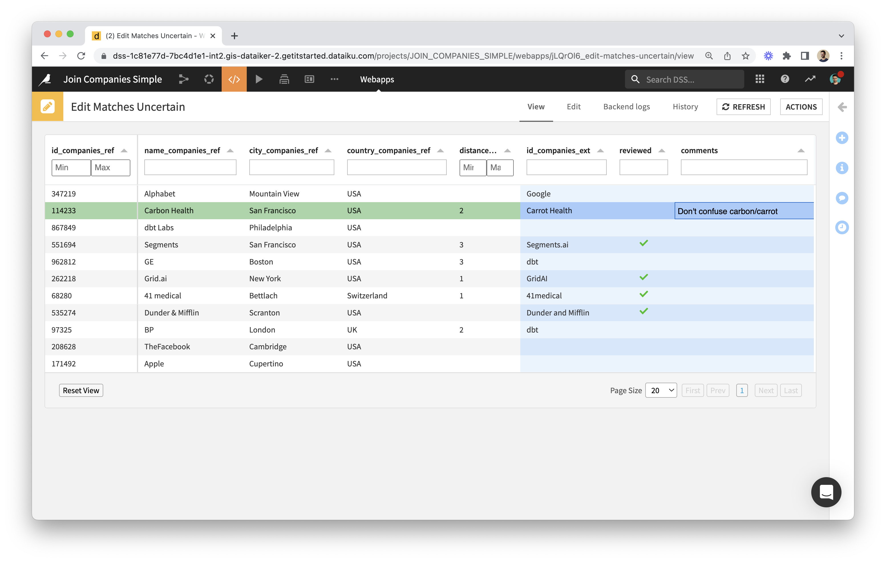

# Getting started

If you haven't, [install the _Editable via Webapp_ plugin](install-plugin) first.

## Create the webapp

* As a preliminary step, please review the schema of the dataset to edit.
  * The webapp uses column meanings to show data (or let you edit it) in the best way. If the meaning wasn't defined explicitly, the webapp uses the storage type instead.
  * It's best to use "string" as storage type for any column that has missing values.
* Go to Webapps, create New Visual Webapp, pick Data Editing.
  * 
  * 
* The webapp settings interface allows to choose a dataset, list primary keys and editable columns, within the "Data" section. 
  * The "Linked Records" section allows to specify editable columns whose values correspond to primary key values of another dataset.
  * In the "Layout" section you can choose to freeze editable columns to the right-hand side (which is useful when there are many columns), and to group rows by one or more columns.
  * Additional settings can be provided via the ["editschema" in JSON](editschema).

## Start the webapp

Here is an example of what a data editing webapp would look like:

Here are the datasets that the webapp backend creates automatically upon starting up, if they don't already exist:

 1. **_editlog_** is the raw record of all edits made via the webapp. The schema is always the same. Here is an example: 
 2. **_editlog\_pivoted_** is the output of a _pivot-editlog_ recipe and the user-friendly view of edits. Its schema is a subset of that of the original dataset (it just doesn't have columns that are display-only, but it has the same key columns and the same editable columns). Here it is in the previous example: .
 3. **_edited_** is the output of a _merge-edits_ recipe that feeds from the original dataset and the _editlog\_pivoted_. It corresponds to the edited data that you are seeing via the webapp; however, it is not in sync with the webapp: it's up to you to decide when to build it in the Flow.

These datasets are created on the same connection as the original dataset. For edits to be recorded by the webapp, this has to be a write connection. If that's not the case, you can change the connection of these datasets as soon as they've been added to the Flow.

## Use the webapp to make some edits

Edits made via the webapp will instantly add rows to the _editlog_.

Data table features:

* Each column can be resized and filtered.
* Filtering:
  * The default filter is a textual one.
  * In the case of a display-only boolean column, the filter is a tristate checkbox (or a simple checkbox if you specified the column type to be "boolean_tick" via the advanced settings' [editschema](editschema)).
  * Editable boolean columns will have a textual filter that you can use by typing "true" or "false".
* Right-clicking on the column name will show a menu with an option to hide the column, and an option to group rows according to the column's values.
* All of this can be reset by clicking on the "Reset View" button in the bottom-left corner.

## Use the new datasets in the Flow

Depending on your use case, you would add recipes downstream of _editlog\_pivoted_ or of _edited_. For instance, you may only need access to edited rows, so to _editlog\_pivoted_, instead of _edited_ which also contains rows that weren't edited.

You decide when to build the datasets downstream of the _editlog_ (including _editlog\_pivoted_ and _edited_).

## Next

* [Going further](going-further)
* [Sample project: Join Companies](sample-project-join-companies)
