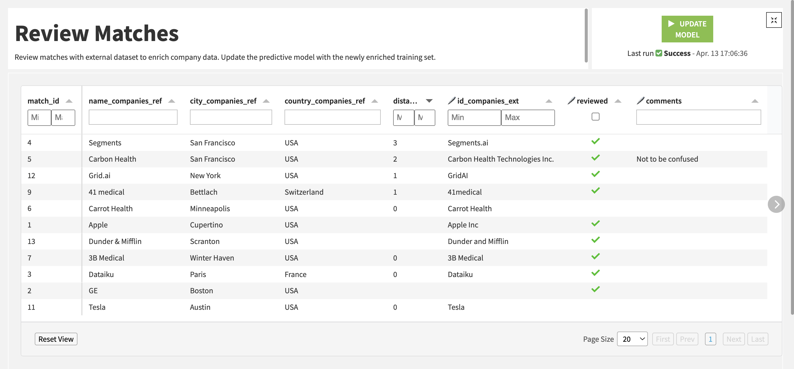

# Going further

## Adding the webapp to a Dashboard

The best way to make this webapp accessible to end-users is by publishing it to a Dashboard. From there you can add "tiles", such as a Text one with instructions, or a Scenario tile, and adjust the layout. The Scenario tile is displayed as a button to run a chosen scenario; this is a great way to let the end-user run computations that take edits into account.

## FAQ

### What happens if my source dataset changes?

The webapp automatically detects changes in the original dataset, in which case it shows a button to refresh the data. This detection is carried out by periodically checking the last build date of the dataset.

As a consequence, it only works if this isn't a "source" dataset, i.e. there are recipes/datasets upstream. If you want to refresh the webapp upon changes of a source dataset, please create a Scenario with a "Restart webapp" step and a "Trigger on dataset change" or a "Trigger on sql query change".

### What happens if I change primary keys or editable columns in the webapp settings?

* Primary key:
  * Add:
    * If this primary key had already been in use in the past (and you're adding it back), there may be rows in the editlog that contain a value for this key, and these rows will be taken into account.
    * Otherwise, previous edits won't be taken into account by the webapp / the recipes.
  * Remove:
    * If the remaining keys allow to uniquely identify a row in the dataset, then there is no impact.
    * Otherwise, many rows could be impacted by a single row of the editlog (instead of a single row).
* Editable column:
  * Add: no impact.
  * Remove: previous edits on this column won't be taken into account by the webapp / the recipes, and they won't appear in _editlog\_pivoted_ (but they will still be in the editlog).

## Troubleshooting

If the webapp backend started successfully but the webapp itself isn't functioning as expected, clear the browser's cached images and files.

