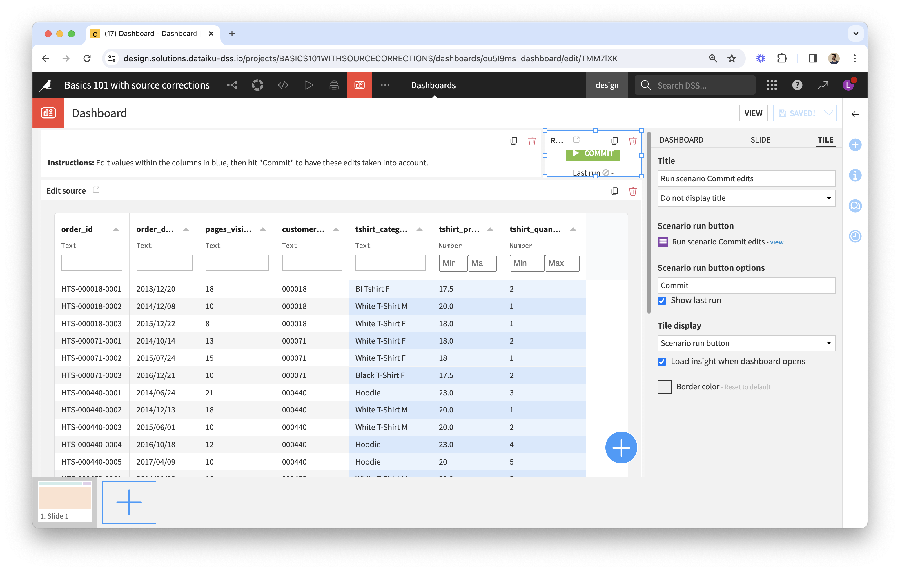
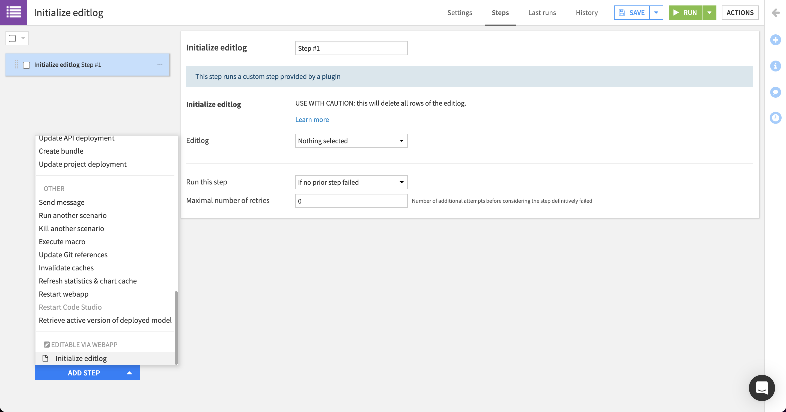
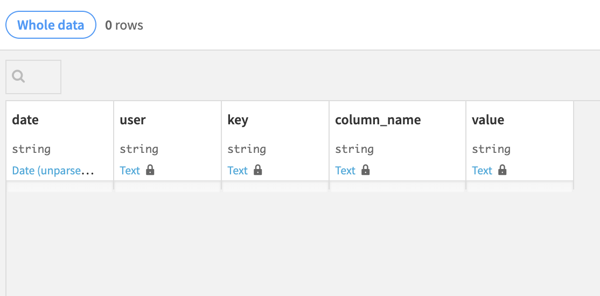
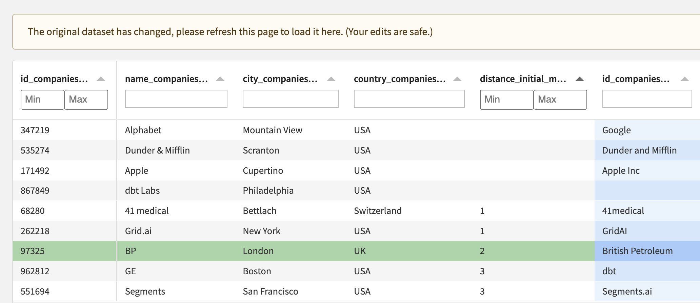

# Going further

## Adding the webapp to a Dashboard

The best way to make this webapp accessible to end-users is by publishing it to a Dashboard. From there you can add "tiles", such as a Text one with instructions, or a Scenario tile, and adjust the layout. The Scenario tile is displayed as a button to run a chosen scenario; this is a great way to let the end-user run computations that take edits into account.

## Deploying to production (automation node)

1. Make sure that the version of the plugin installed on the Automation node is the same as on the Design node.
2. Create a new bundle (do not include the contents of the editlog in the bundle, as it would replace edits made in production with those made on the design node).
3. If this isn't a first deployment of your project but an update, go straight to step 4. Otherwise, initialize the editlog:
   * Some context and motivation: upon deploying the project bundle for the first time, the editlog dataset will exist and it will have a schema, but it may appear as having an invalid configuration; this would be the case with a SQL connection different from the one used in the design node, as the table won't have been created upon bundle deployment. The reason for this is that, unlike most datasets managed by Dataiku, this one is a source dataset (with no recipe upstream).
   * Please create and run a scenario with an "Initialize editlog" step, to ensure that the editlog is properly initialized. 
   * You can then open the dataset and make sure that you see an empty editlog that looks like this: 
   * You can then delete the scenario, to make sure that it won't be used accidentally in the future (which would cause losing all edits).
4. Build the dataset used by the webapp as the "original dataset" to edit.
5. (Stop and) Start the webapp.

Demo videos:
* [Deploy to production](https://www.loom.com/share/e47c5d09871741c48062e3547108bb39)
* [Update in production](https://www.loom.com/share/8b806a65e50a4406b9ec3d4a31495205)

## Feedback loops

In some use cases the data to review/edit in the webapp depends on previous edits. Check out our [sample project](sample-project-join-companies) that demonstrates this and shares best practices.

## FAQ

### What happens if my source dataset changes?

The webapp automatically detects changes in the original dataset, by periodically checking the last build date of the dataset. As a consequence, it only works if this isn't a "source" dataset but the output of a recipe.

### What happens if I change primary keys or editable columns in the webapp settings?

* Primary key:
  * Add:
    * If this primary key had already been in use in the past (and you're adding it back), there may be rows in the editlog that contain a value for this key, and these rows will be taken into account.
    * Otherwise, previous edits won't be taken into account by the webapp / the recipes.
  * Remove:
    * If the remaining keys allow to uniquely identify a row in the dataset, then there is no impact.
    * Otherwise, many rows could be impacted by a single row of the editlog (instead of a single row).
* Editable column:
  * Add: no impact.
  * Remove: previous edits on this column won't be taken into account by the webapp / the recipes, and they won't appear in _editlog\_pivoted_ (but they will still be in the editlog).

## Troubleshooting

If the webapp backend started successfully but the webapp itself isn't functioning as expected, clear the browser's cached images and files.
