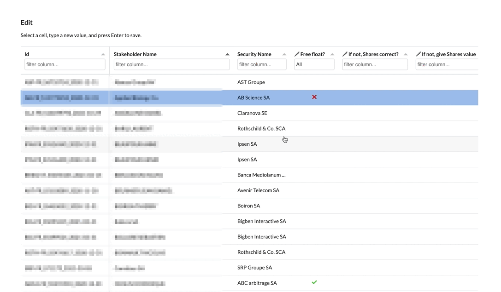

# Data Editing plugin

* Requirements:
  * Dataiku 9 or more recent
  * Ability to install plugins to your Dataiku instance and to create associated code env (Dash libraries)
  * For Dataiku Online:
    * Make sure the "code env" feature is activated; if it's not, use the contents of the requirements file to create your first environment
    * Enable maintenance access so that someone can install the plugin for you
* [Install the plugin](install-plugin)
* [Get started](get-started)

