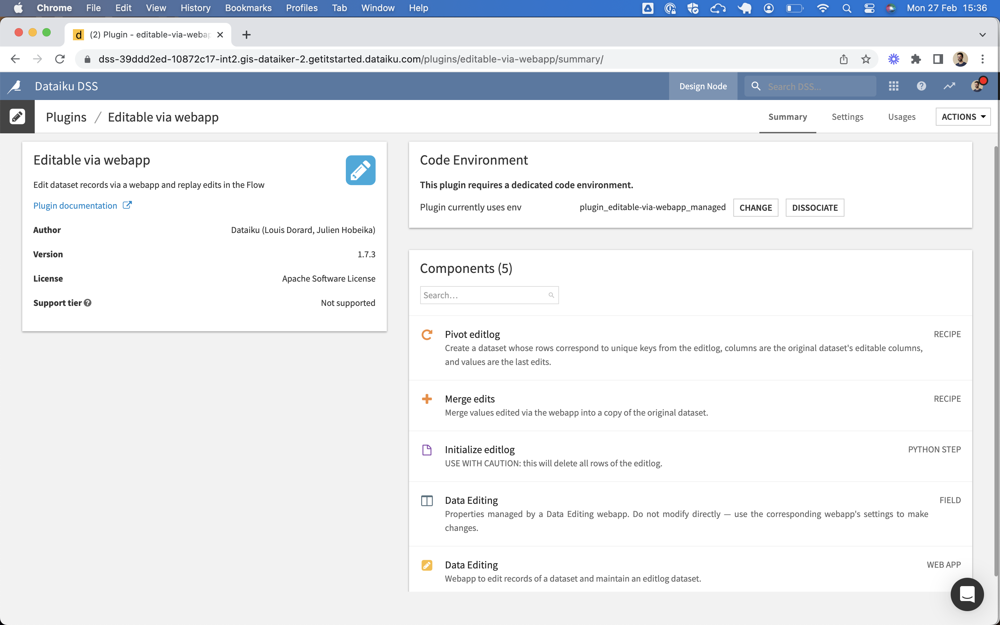
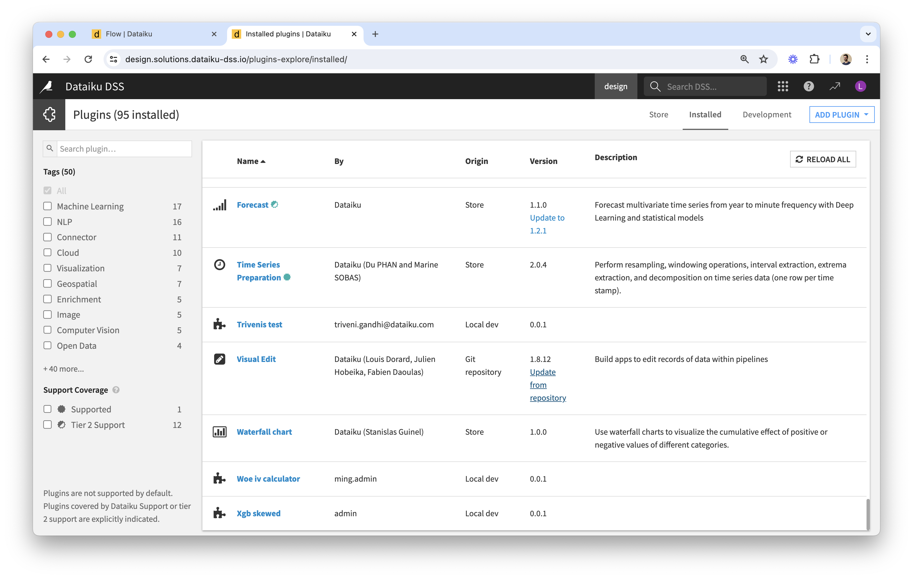

# Installation

## How to install the plugin

The plugin can be installed via Git (it is not yet available through the plugin store).

### Dataiku Cloud

* Enable maintenance access
* Share this URL with Dataiku Support and ask them to install the plugin for you

### Dataiku self-managed

#### Requirements

* **Dataiku V9+**
* Ability to install plugins on your Dataiku instance and to create an associated code env based on **Python 3.8 or 3.9**.

#### Instructions

* From the Plugins page of your Dataiku instance, click on the "Add Plugin" button in the top right corner and choose "Fetch from Git repository":
  * Repository URL: `git@github.com:dataiku/dss-visual-edit.git`
  * Development mode: leave unticked
  * Checkout: choose `master` under "Branch", to install the latest version of the plugin; alternatively, choose a version number under "Tag"
  * Path in repository: `dss-plugin-visual-edit`
* Create the code environment for this plugin. Select the version of Python you want to use and the types of containers you plan to use as backend for Visual Edit webapps or for running recipes provided by the plugin (the easiest is to choose All).
* The plugin is installed!  We'll see how to use each of its components in the next guide.

## How to update the plugin

From the Plugins page of your Dataiku instance, go to the "Installed" tab, find "Visual Edit" in the list and click on the "Update from repository" link. 

Release notes for all versions are available at [https://github.com/dataiku/dss-visual-edit/releases](https://github.com/dataiku/dss-visual-edit/releases).
