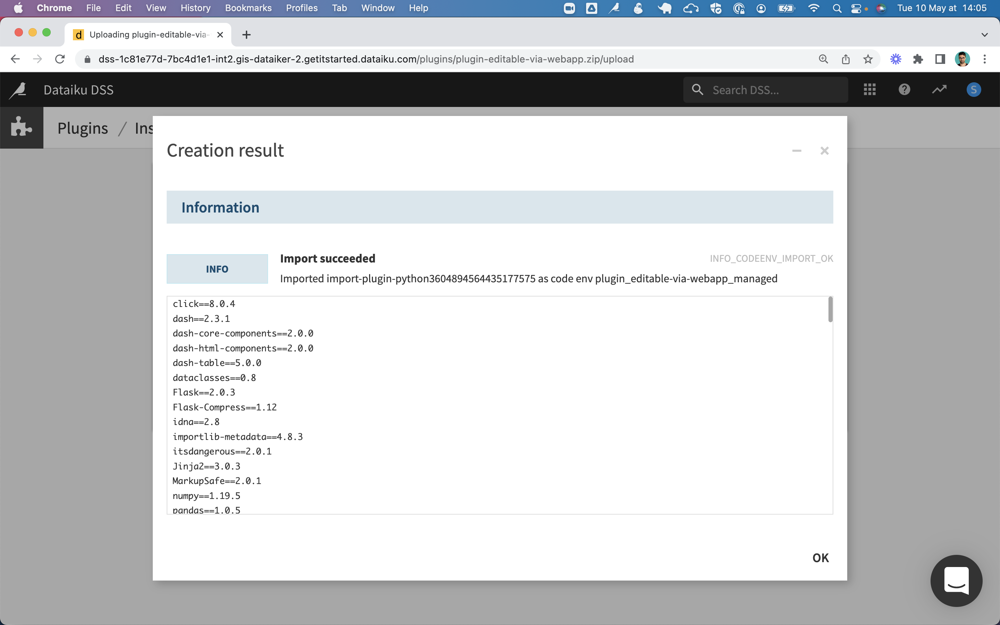
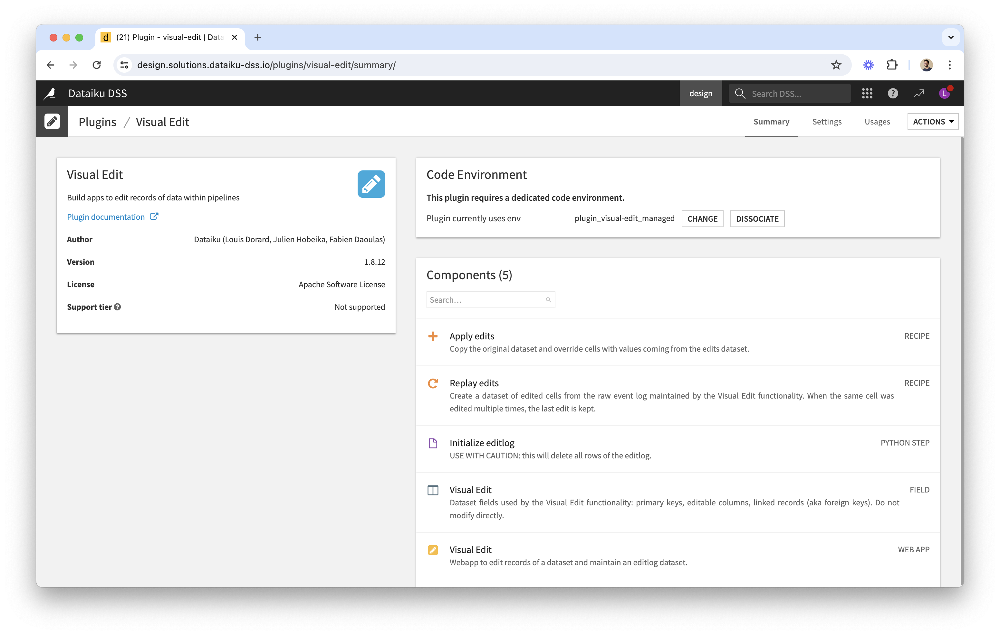

# Install the _Editable via Webapp_ plugin

Requirements:

* Dataiku 9 or more recent
* Ability to install plugins on your Dataiku instance and to create associated code env (Dash libraries)
* For Dataiku Online:
  * Make sure the "code env" feature is activated; if it's not, use the contents of the requirements file to create your first environment
  * Enable maintenance access so that someone can install the plugin for you

How to install:

* Upload the ZIP file that contains the plugin, to your Dataiku instance
  * 
  * 
* Create the code environment for this plugin
  * 
  * 
  * 
  * 
  * 
* The plugin is installed! 
