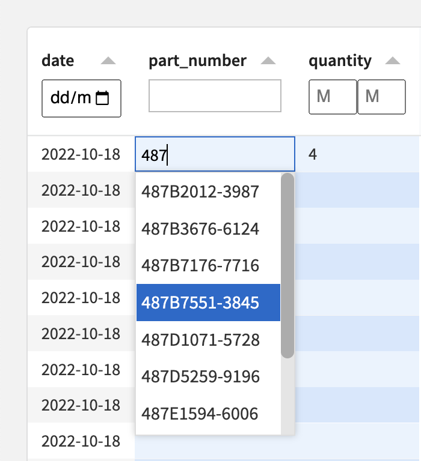

# Set up dropdown editing via "Linked Record" columns

Define a "Linked Record" column to enforce a specific set of values for an editable column (and avoid free-text input errors). The cell editor will be a dropdown widget.

## How it works

Requirements:

- The list of all available options must be provided as a Dataiku dataset, called the "Linked Dataset", and it can be of any size.
- Values of the Linked Record column must correspond to records found in the Linked Dataset (see below).

The dropdown behavior depends on the number of options in the Linked Dataset:

- **Few options (e.g. categories):**
  - All of them are shown in the dropdown.
- **Many options (> 1,000):**
  - A search bar is available to filter options.
  - When the dropdown is opened (no search term provided), the first 1,000 options are shown by default, to give the user a sense of the available values and their amount.
  - Start typing, and only options that start with the search term will be presented. This is capped at 10 to avoid overwhelming the user. 

## Creating the Linked Dataset (if it doesn't exist yet)

When there are only a few options and no such dataset exists in your project, you can either...

- Create it as an [Editable dataset](https://doc.dataiku.com/dss/latest/connecting/editable-datasets.html).
- If the options are limited to values already present in the original dataset, you can create the Linked Dataset by using a Group recipe to extract the distinct values of the column.

## Specifying Linked Record columns

Linked Record columns can be defined in the Visual Webapp's "Edit" tab, in the "Linked Records" section.

- **Linked Record Column:** the column of the original dataset to be edited, whose values match those found in the Linked Dataset's Primary Key column (see below).
  - Make sure this column is also defined as an **Editable column** in the "Editable Columns" section.
  - Make sure the storage type of this column is either **string** or **integer**.
- **Linked Dataset:** a dataset containing the set of options to be displayed in the dropdown.
  - When there are more than 1,000 records, we recommend using a dataset on an SQL connection, for performance reasons (search/options retrieval will be much more efficient).
  - If the dataset has less than 1,000 records or if it is not on an SQL connection:
    - Only the first 10,000 records will be used.
    - They will be loaded in memory, upon starting up the webapp.
    - As a result, if changes are made to the values in this dataset, the Visual Edit Webapp will need to be restarted in order to see the new values.
  - **Primary Key:** the column of the Linked Dataset whose values correspond to those in the Linked Record Column, and that can be used as a unique identifier for each option in the dropdown.
    - Storage type must be **string** or **integer**.
    - Values must be unique within the linked dataset and not empty
  - **Label:** a column of the Linked Dataset used for display purposes in the dropdown, as an alternative to the actual Primary Key values.
    - Use this when Primary Key values are not user-friendly.
    - If you don't have/need a Label column, choose the same column as the Primary Key.
  - **Additional Lookups:** column names in the Linked Dataset giving more context to the label.
    - When using lookup columns, the label column should be different from the label column and from the primary key column.
    - Values should not be empty.
    - The maximum number of lookup columns is two.

## Examples

### Dropdown with many options (companies)

- The screenshot above shows the review stage of an Entity Resolution workflow for company names, where the system proposes matches with confidence scores, and humans validate/correct them.
- The "Matched Entity" column is a Linked Record column, linked to a dataset of canonical records in a reference database of tens of thousands of companies. It can be adjusted by the user via a dropdown.
- For Hana Financial Group, a company in South Korea, the user typed "hana" in the Matched Entity search box. Suggestions are coming up: HanAll Biopharma, Hana Bank, Hana Microelectronics, Hanatour Japan.
- Lookup columns provide additional information about each option: here, they show the company's country and industry. This helps the user pick the right option.
- In the backend, values of the "Matched Entity" column correspond to the Primary Key of the linked dataset, which is a unique company ID. A label column is used to show company names instead of IDs.

The configuration of "Matched Entity" as a Linked Record column could look like this:

- **Linked Column:** Matched Entity
- **Linked Dataset:** entities_ext
- **Primary Key:** ID
- **Label:** Name
- **Additional Lookups:** Country, Industry

The original dataset would contain the following columns and record:

| ID | Name        | Matched Entity |
|----|-------------|----------------|
| 354a8fea8ec9f59d  | Hana Financial Group  | 50969602              |

The Linked Dataset (entities\_ext) would contain the following columns and record:

| ID | Name        | Country | Industry |
|----|-------------|---------|----------|
| 50969602  | Hana Bank  | South Korea | Finance  |

Read more about this use case in the [Entity Resolution with Dataiku](https://blog.dataiku.com/accelerating-entity-resolution) blog post.
