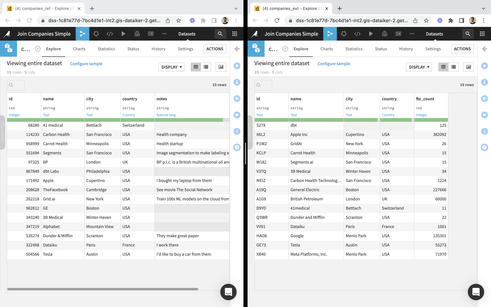
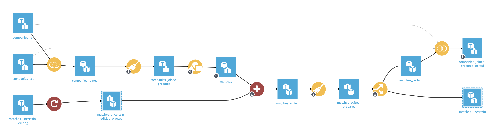

# Sample project: Join Companies

_In this article we introduce the Join Companies use case via a demo and we explain how to replicate with our sample project. We also explain how the project works behind the scenes, the steps to build it from scratch, then we discuss deployment and lifecycle._

## Introduction

This project demonstrates a case of feedback loop, where the data to review/edit in the webapp depends on previous edits. It also demonstrates usage of linked records and lookup columns.

<iframe src="https://www.loom.com/embed/7b79e45e755544f8baf1ff3ed1bf60ee" frameborder="0" webkitallowfullscreen="" mozallowfullscreen="" allowfullscreen="" style="height: 400px; width: 600px"></iframe>

How to replicate:

* [Download project bundle](dss-bundle-JOIN_COMPANIES_SIMPLE-webapp-based.zip). Note: the project uses the managed Amazon S3 data connection provided on Dataiku Online — you may have to remap to one of your own data connections.
* Build dataset `companies_joined_prepared_edited` (recursive build).
* Go to Webapps and start "Edit Matches Uncertain".
* Go to Dashboards and to "Company Matches":
  * Make some edits
  * Click on the Update button, which will trigger the Update scenario.
* Use the Init scenario to reset all edits.

## Behind the scenes

In this project we match companies found in a reference dataset called (`companies_ref`, shown below on the left-hand side) with companies found in an external dataset called (`companies_ext`, on the right-hand side).



The output is a dataset which has all columns: name, city, country, notes _and_ fte_count.

This section presents how the project works in its current state. Alternatively, you can go straight to the next section to review how it was built from scratch.

### Webapp Setup

As you can see in the datasets above, comparing company names can work in some cases but not all (e.g. "TheFacebook" and "Meta"). We set up a data editing webapp to have a human assign matches that the machine couldn't find.

<iframe src="https://www.loom.com/embed/d28df84ca26b49a2a25f802c92cfbb5e" frameborder="0" webkitallowfullscreen="" mozallowfullscreen="" allowfullscreen="" style="height: 400px; width: 600px"></iframe>

### Flow

Here is an overview of the project's Flow:



#### Editlog

The Flow includes an editlog dataset and recipes provided by the Data Editing plugin (those in red). If you're not familiar with them, check out this video for a live demonstration:

<iframe src="https://www.loom.com/embed/17b4c5bf685f4f30a00a51c53d4d006f" frameborder="0" webkitallowfullscreen="" mozallowfullscreen="" allowfullscreen="" style="height: 400px; width: 600px"></iframe>


#### Walkthrough

<iframe src="https://www.loom.com/embed/532c66806723419f9161614b94b749b1" frameborder="0" webkitallowfullscreen="" mozallowfullscreen="" allowfullscreen="" style="height: 400px; width: 600px"></iframe>

#### Feedback Loop

The Flow implements a feedback loop: the data for review is in `matches_uncertain` and edits can be found in `matches_uncertain_editlog_pivoted`, which is upstream.

<iframe src="https://www.loom.com/embed/7f51ae7c61f14da28f449c3b7d1f478e" frameborder="0" webkitallowfullscreen="" mozallowfullscreen="" allowfullscreen="" style="height: 400px; width: 600px"></iframe>

## Making of

### Initial flow

* We started with a left Fuzzy Join between `companies_ref` and `companies_ext` based on `id`, and specified that we wanted to output matching details.
* We needed additional colums to store reviewing information, such as the approval of a match (boolean) and comments (string). These were created as empty columns in a Prepare recipe. We also extracted the distance information found in the `meta` column of the Fuzzy Join output (where matching details are stored).
* We added a Group recipe to deal with cases where several matches were found in `companies_ext` for the same company in `companies_ref`, so that we only keep the closest match. As a result, rows in the output dataset (named `matches`) are uniquely identified by their value of `id_companies_ref`.
* We created a `corrections` folder that could hold data uploaded as CSV files, and turns them into a dataset named `corrected_data` (as an alternative, you could also create an Editable dataset).
  * Its columns should include `id_companies_ref` which acts as primary key, and columns whose values can be overriden by the end-user reviewing company matches: `id_companies_ext`, `reviewed` and `comments`.
  * For testing purposes, we uploaded a tiny file containing:

```csv
id_companies_ref,id_companies_ext,reviewed,comments
208628,XB40,True,""
114233,MEIZ,True,""
```

* We used the plugin's Merge recipe with `matches` and `corrected_data` as inputs, and created `matches_edited`. This required to set the “primary_keys” custom field of `matches`, so that the Merge recipe knows how to join its inputs.
* We added a `to_be_reviewed` column computed by a Prepare recipe, and used it to Split `matches_edited` into two datasets, for certain and uncertain matches.
* Finally, a 3-way join between the `companies_ref`, `companies_ext` and `matches_certain` produces the output we were looking for: a dataset of companies that has both the `notes` and `fte_count` columns.

### Reviewing and updating

Reviewing could be made in a spreadsheet program. It involves:

* Downloading `matches_uncertain`
* Making changes and saving them to a new CSV file
* Uploading this file to `corrections`
* Rebuilding `matches_uncertain`.

### Usage of the plugin's Visual Webapp component

* Set up the webapp (You can find screenshots in the [Getting started guide](https://dataiku.github.io/lca/get-started)):
  * Create new Visual Webapp and edit its settings:
    * The dataset to edit is `matches_uncertain`.
    * `id_companies_ext` is an editable column and is set to be a "linked record" (linking to the `id` column of `companies_ext`). It contains values set from the Fuzzy Join but also missing values (when no match was found).
    * There are 2 more editable columns: `approved` and `comments` (that we created as placeholders for reviewing information). Initially, all values are empty.
* Start webapp. This creates the editlog and editlog_pivoted datasets.
* Adapt the flow: use `matches_uncertain_editlog_pivoted` as replacement of `corrected_data`.
* Use webapp.
* Implement update mechanism:
  * Preliminary remarks:
    * The webapp uses the same code as the Merge edits recipe that we have in our flow, except that it uses `matches_uncertain` instead of `matches`. Also, it uses a "live" version of the editlog pivoted, instead of the dataset found in the flow and computed from the editlog.
    * Marking a match as approved doesn't automatically move it from `matches_uncertain` to `matches_certain`. We need to rebuild these datasets. For this, we need to make sure that the editlog_pivoted dataset has been rebuilt.
  * Steps:
    * Create an Update scenario with a force-rebuild of `matches_uncertain_editlog_pivoted` and a rebuild of `matches_uncertain`.
    * Create a dashboard which embeds the webapp and has a button to run that scenario (see screenshot in [Going further > Adding the webapp to a Dashboard](https://dataiku.github.io/lca/going-further#adding-the-webapp-to-a-dashboard)).

## Lifecycle

### Project deployment and update in production

Once the project has been built and successfully tested on a Design node, you would deploy it to an Automation node.

<iframe src="https://www.loom.com/embed/e47c5d09871741c48062e3547108bb39" frameborder="0" webkitallowfullscreen="" mozallowfullscreen="" allowfullscreen="" style="height: 400px; width: 600px"></iframe>

The matching algorithm may change in time. Here is a demo where we update one of its parameters, deploy a new version of the project to Automation node, and see the impact.

<iframe src="https://www.loom.com/embed/8b806a65e50a4406b9ec3d4a31495205" frameborder="0" webkitallowfullscreen="" mozallowfullscreen="" allowfullscreen="" style="height: 400px; width: 600px"></iframe>

### Live data ingestion

In a real-world setting, you would connect the reference and external datasets to live data sources. You would run an automation scenario on a given schedule to recompute the data for review in the webapp, based on changes in the source data. Let's discuss the potential impact of these changes:

* There could be additional companies in the reference dataset, in which case there could be new matches to review. This doesn't have an impact on previous matches.
* There could be additional companies in the external dataset, or company names could change. As a result, the match found for a given company in the reference dataset could change.
  * If this company wasn't previously reviewed, it will still appear in the webapp but the suggested match will be different.
  * If the company was previously reviewed, it won't appear in the webapp and there won't be any impact. This is because matches get overridden by edits, which are based on ids.
