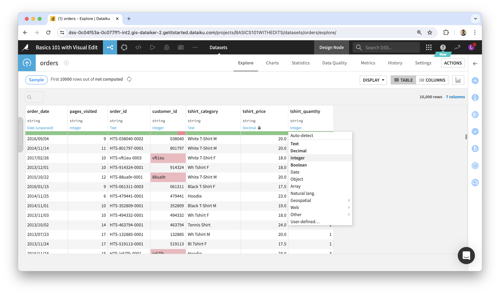
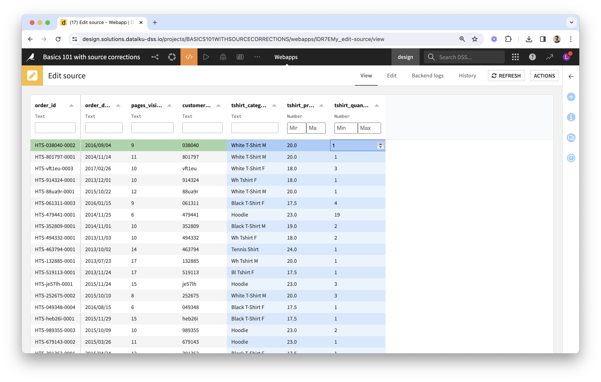

# Troubleshooting

## Column types are incorrect: the way data is displayed or edited in the webapp is not as expected

The plugin's Visual Webapp uses the Original Dataset's schema to display, sort, filter data and enable editing in the most appropriate way.

When a column meaning was defined explicitly, the webapp will use it; otherwise it will consider the storage type instead.

* Use a “Boolean” meaning to show boolean values as ticks and crosses and to enable editing with checkboxes; filtering will be text-based;
* Use a numerical meaning to restrict editing to numbers only, to enable sorting by numerical order, and filtering with min-max values;
* Use a “Date” meaning to enable sorting by chronological order, editing and filtering with date pickers;
* Use a “Text” meaning for both free-text input and for dropdowns (this will be specified in the Visual Webapp's settings), text-based filtering, and sorting by alphabetical order.

When making changes, restart the webapp to have them taken into account.

### Example

When following the steps from the "How to Use" guide, uploading the orders dataset and using it as-is in Visual Edit, the webapp would look like this:

Tshirt price and quantities are not seen as numerical columns: column types are shown as "Text" in the webapp (below column names) and as a result we can input any type of data in them. This is expected, because all storage types were "string" in the uploaded dataset, and no column meanings were set explicitly. Here is how to fix:

* Set the column meanings for tshirt price and quantities as Decimal and Integer (see lock icon next to the meaning). 
* Restart the webapp. It will now consider these columns as numerical. The webapp should look like this:

You can now test the webapp with a few edits. Here, you should only be able to input numerical values when editing tshirt price and quantities.

## The plugin's webapp/recipes are not behaving as expected

### Relationship between webapp and recipes

* When opening the webapp in your browser, the same code as the recipes' is executed, from the original dataset and the editlog, in order to present an edited view of the data.
* Edits made via the webapp instantly add rows to the _editlog_, but the _edits_ and _edited_ datasets are updated only when you run the corresponding recipes.
* When starting the webapp backend, settings such as primary keys and editable columns are copied into the _Visual Edit_ fields of the original and _editlog_ datasets ([custom fields provided by the plugin](https://doc.dataiku.com/dss/latest/plugins/reference/custom-fields.html)). This is how the recipes have access to settings defined in the webapp.

### About the _Replay edits_ recipe

* The Replay recipe feeds from an _editlog_ dataset.
* The _edits_ dataset in output is the result of "replaying" edit events stored in the log: for a given cell edited multiple times, we would only see the last edited value.
* Its rows are a subset of the original dataset's: it doesn't contain rows where no edits were made.
* While the schema of the _editlog_ dataset is always the same, the schema of _edits_ is a subset of the original dataset's: it doesn't have columns that are display-only, but it has the same key columns and the same editable columns, plus a _last\_edit\_date_ column.

Example:

* _editlog_ in input: 
* _edits_ in output: 

### About the _Apply edits_ recipe

* The Apply recipe feeds from an original dataset and an _edits_ dataset.
* The _edited_ dataset in output is the result of applying the edits to the original dataset: for any given cell identified by its column and primary key values, if a non-empty value is found in _edits_, this value is used instead of the original one.
* It contains the same number of rows as the original dataset.

As a result of the above:

* It is impossible to empty a non-empty cell with this recipe. This is because empty values in _edits_ are ignored.
* You can think of the _edits_ dataset as...
  * A "diff" between edited and original data.
  * A dataset of overrides to apply to the original dataset.
