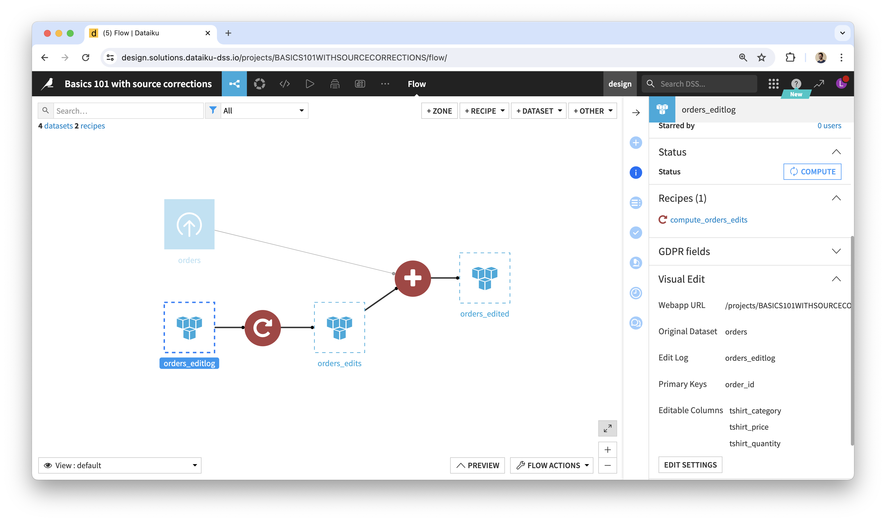

# Using edits in the Flow

## Where to find edits

The webapp is based on the CRUD methods provided by the `EditableEventSourced` Python class. They automatically create 3 datasets upon starting up (if they don't already exist):

Their names start with the original dataset's name. Let's review them by their suffix:

 1. **_editlog_** is the raw record of all edit events captured by the webapp. The schema of this dataset is fixed, whatever the original dataset. Here is an example: 
 2. **_editlog\_pivoted_** is the output of the _pivot-editlog_ recipe (provided by the plugin) and the user-friendly view of edits. In the previous example: 
    * Its schema is a subset of the original dataset's: it doesn't have columns that are display-only, but it has the same key columns and the same editable columns, plus a _last\_edit\_date_ column.
    * Its rows are a subset of the original dataset's: it doesn't contain rows where no edits were made.
    * You can think of it as...
      * A "diff" between edited and original data.
      * A dataset of overrides to apply to the original dataset.
      * The result of "replaying" edit events stored in the log: we only see the last edited values.
 3. **_edited_** is the output of the _merge-edits_ recipe (provided by the plugin) that feeds from the original dataset and the _editlog\_pivoted_.
    * It corresponds to the edited data that you are seeing via the webapp.
    * However, it is not in sync with the webapp: it's up to you to decide when to build it in the Flow.
    * It contains the same number of rows as in the original dataset. For any given cell identified by its column and primary key values, if a non-empty value is found in _editlog\_pivoted_, this value is used instead of the original one.
    * Note that, as a result of the above, it is impossible to empty a non-empty cell with the plugin’s visual webapp and recipes. This is because empty values in _editlog\_pivoted_ are ignored.

These datasets are created on the same connection as the original dataset. For edits to be recorded by the webapp, this has to be a write connection. If that's not the case, you can change the connection of these datasets as soon as they've been added to the Flow.

The recipes are based on the same code as the webapp and the CRUD methods.

## Leveraging edits for analytics

Depending on your use case, you would add recipes downstream of _editlog\_pivoted_ or of _edited_. For instance, you may only need access to edited rows, found in _editlog\_pivoted_, instead of _edited_ which also contains rows that weren't edited. This is the case in our [sample project](sample-project-company-resolution).

You decide when to build the datasets downstream of the _editlog_ (including _editlog\_pivoted_ and _edited_).

## Next

* [Going further](going-further): Resetting edits on a design node, Deploying to production (automation node), Feedback loops, FAQ.
* [Sample project: Company Resolution](sample-project-company-resolution)
* [Sample project: AI Feedback App](sample-project-ai-feedback-app)